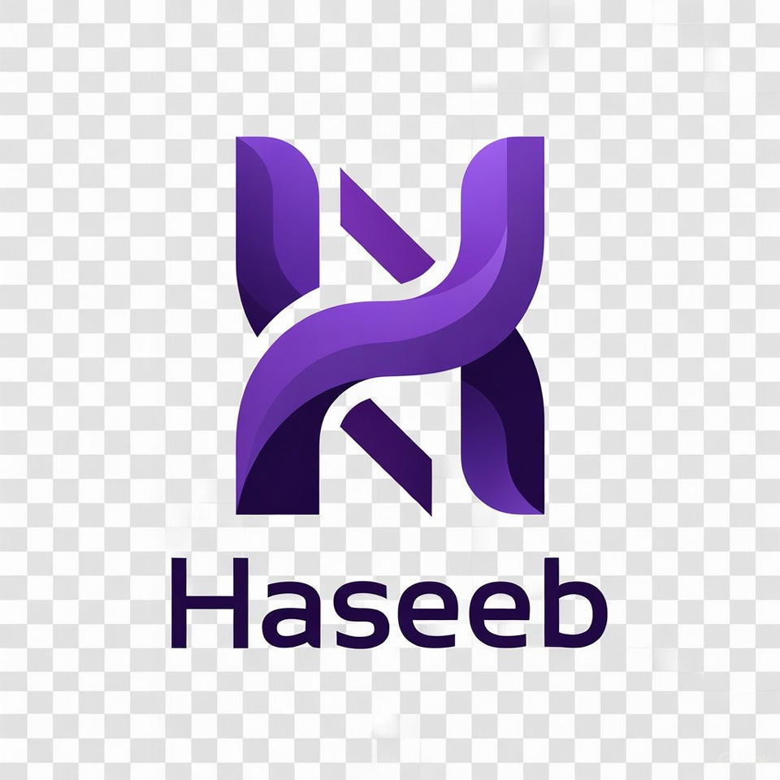

# Haseeb Javed — Frontend Developer & Creative Coder

A modern, interactive personal portfolio website showcasing frontend development skills, projects, and professional experience. Built with cutting-edge technologies including React, GSAP animations, Three.js, and Tailwind CSS.



---

## 🌟 Features

### ✨ Animations & Interactions

- **Letter-split animated name** with smooth GSAP transitions on the Hero section
- **Waving hand emoji** with natural motion in the greeting
- **Ambient orbs** that move fluidly in the background
- **Cursor spotlight effect** that follows mouse movement
- **Shimmer text animation** on the role description
- **Framer Motion** animations for card entrance effects
- **Scroll indicator** with smooth animations
- **Glass morphism** design elements

### 📱 Responsive Design

- Mobile-first responsive layout using Tailwind CSS
- Optimized for all screen sizes (mobile, tablet, desktop)
- Touch-friendly navigation and interactions
- Adaptive typography with fluid sizing

### 🎯 Sections

- **Hero/About** — Eye-catching introduction with animated name and description
- **Skills** — Display of technical expertise and tools
- **Projects** — Showcase of portfolio projects with descriptions
- **Contact** — Call-to-action for getting in touch
- **Navigation** — Sticky navbar with smooth scroll navigation
- **Footer** — Social links and copyright information

### 🎨 Design

- Dark theme with modern gradient accents
- Purple, cyan, and orange color palette
- Custom glassmorphism components
- Smooth transitions and micro-interactions
- Professional typography using Inter font

---

## 🛠️ Tech Stack

### Frontend Framework

- **React 19** — Latest React with hooks and functional components
- **Vite** — Ultra-fast build tool and development server
- **React DOM** — Client-side rendering

### Styling & Animation

- **Tailwind CSS 4** — Utility-first CSS framework
- **GSAP 3** — Advanced motion graphics and animations
- **Framer Motion** — React animation library for components
- **@GSAP/React** — React wrapper for GSAP

### Icons & UI

- **React Icons** — Icon library with multiple icon sets
- **React Intersection Observer** — Detect when elements are in viewport

### Development Tools

- **ESLint** — Code quality and consistency
- **Vite ESLint Plugin** — Eslint integration with Vite
- **TypeScript Support** — Type definitions included

---

## 📦 Project Structure

```
My Portfolio/
├── public/
│   ├── Logo.jpeg          # Favicon and branding logo
│   └── [other assets]
├── src/
│   ├── components/
│   │   ├── Navbar.jsx     # Navigation header
│   │   ├── Hero.jsx       # Landing section with introduction
│   │   ├── Skills.jsx     # Technical skills showcase
│   │   ├── Projects.jsx   # Portfolio projects
│   │   ├── Contact.jsx    # Contact section
│   │   └── Footer.jsx     # Footer with links
│   ├── assets/            # Images and static files
│   ├── App.jsx            # Main app component
│   ├── index.css          # Global styles
│   └── main.jsx           # React entry point
├── index.html             # HTML template
├── package.json           # Dependencies and scripts
├── vite.config.js         # Vite configuration
├── eslint.config.js       # ESLint configuration
└── README.md              # This file
```

---

## 🚀 Getting Started

### Prerequisites

- **Node.js** 16.0 or higher
- **npm** or **yarn** package manager

### Installation

1. **Clone the repository**

   ```bash
   git clone https://github.com/haseebjaved4212/My-Portfolio-0.3.git

   cd My-Portfolio
   ```

2. **Install dependencies**

   ```bash
   npm install
   ```

3. **Start development server**
   ```bash
   npm run dev
   ```
   The site will be available at `http://localhost:5173`

---

## 📜 Available Scripts

### Development

```bash
npm run dev
```

Starts the development server with HMR (Hot Module Replacement). Perfect for development and testing changes in real-time.

### Build

```bash
npm run build
```

Creates an optimized production build in the `dist/` folder. This generates minified and optimized assets ready for deployment.

### Preview

```bash
npm run preview
```

Preview the production build locally before deployment.

### Linting

```bash
npm run lint
```

Run ESLint to check code quality and consistency. Fix issues with `npm run lint -- --fix`.

---

## 🎨 Customization

### Update Personal Information

Edit `src/components/Hero.jsx`:

- Change `NAME = 'Haseeb Javed'` to your name
- Update description and bio text
- Modify the `tech` array with your skills

### Modify Colors

Global theme colors are defined in the CSS. Key colors:

- Primary: `#7c3aed` (Purple)
- Secondary: `#06b6d4` (Cyan)
- Accent: `#ffb784` (Orange)

### Add Your Projects

Edit `src/components/Projects.jsx` to showcase your work with:

- Project title and description
- Technologies used
- Live links and repositories
- Project images/previews

### Update Skills

Modify `src/components/Skills.jsx` to list your:

- Programming languages
- Frameworks and libraries
- Tools and technologies
- Certifications

---

## 🎯 Animation Details

### Hero Name Animation

- Initial entry: Letters slide in with staggered timing
- On hover: Letters animate upward with color fill and scale
- Colors cycle through: `#d2bbff`, `#4cd7f6`, `#ffb784`, `#a78bfa`, `#34d399`, `#f472b6`

### Waving Emoji

- Smooth wave motion using CSS keyframe animation
- 1.2s infinite loop with natural easing
- Transform origin set at 70% 70% for wrist-like rotation

### Ambient Orbs

- Three animated gradient orbs moving independently
- Different durations (5s, 6s, 8s) create organic motion
- Positioned with absolute positioning for layering effect

### Cursor Spotlight

- Real-time tracking of mouse position
- Radial gradient following the cursor
- Creates interactive lighting effect

---

## 🌐 Deployment

### Vercel (Recommended)

1. Push code to GitHub
2. Connect repository to Vercel
3. Vercel auto-detects Vite and deploys

### Netlify

1. Connect GitHub repository
2. Build command: `npm run build`
3. Publish directory: `dist`

### GitHub Pages

1. Update `vite.config.js` with correct base URL
2. Run `npm run build`
3. Deploy `dist` folder to GitHub Pages

---

## 📋 Browser Support

- ✅ Chrome/Edge (latest)
- ✅ Firefox (latest)
- ✅ Safari (latest)
- ✅ Mobile browsers

---

## 🤝 Contributing

You can:

- Report issues and bugs
- Suggest new features
- Submit pull requests with improvements

---

## 📄 License

This project is open source and available under the MIT License.

---


## 🙏 Acknowledgments

- **GSAP** — For powerful animation capabilities
- **React & Vite** — For the amazing development experience
- **Tailwind CSS** — For utility-first styling
- **Framer Motion** — For smooth React animations
- **React Icons** — For beautiful icon sets

---

## 📝 Notes

- This portfolio is continuously updated with latest projects
- Animations are optimized for performance across devices
- Mobile experience is prioritized in responsive design
- All code follows ESLint standards for consistency

---

**Last Updated:** April 2026  
**Version:** 0.3

--- 
<h3 align="center">
    
</h3>